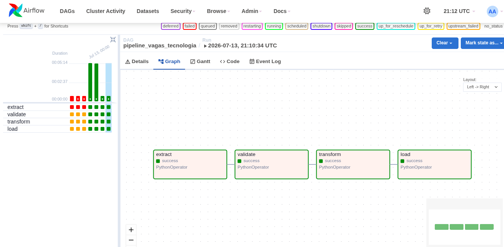

# Pipeline de Dados — Vagas de Tecnologia (RemoteOK → PostgreSQL)

Pipeline de dados que extrai vagas de tecnologia da API pública [RemoteOK](https://remoteok.com/api), valida a qualidade dos registros, transforma e padroniza os dados, e os carrega em um banco PostgreSQL. Toda a execução é orquestrada por uma DAG do **Apache Airflow**.

## Índice

- [Arquitetura](#arquitetura)
- [Requisitos do projeto (RF/RNF)](#requisitos-do-projeto-rfrnf)
- [Estrutura do projeto](#estrutura-do-projeto)
- [Modelo de dados](#modelo-de-dados)
- [Tecnologias](#tecnologias)
- [Pré-requisitos](#pré-requisitos)
- [Configuração e instalação](#configuração-e-instalação)
- [Como executar](#como-executar)
- [Onde ver os resultados](#onde-ver-os-resultados)
- [Solução de problemas comuns](#solução-de-problemas-comuns)
- [Evidências de execução](#evidências-de-execução)
- [Resultados obtidos](#resultados-obtidos)

## Arquitetura

```text
RemoteOK API
    │
    ▼
EXTRAÇÃO (Python + requests, retry com backoff exponencial)
    │  salva JSON bruto e completo, sem nenhuma transformação
    ▼
data/raw/  (JSON)
    │
    ▼
VALIDAÇÃO (campos obrigatórios, datas, salários, URL, duplicidade)
    │
    ├──► inválidos ──► data/quarantine/ (JSON + motivo do erro)
    │
    ▼
data/validated/  (JSON)
    │
    ▼
TRANSFORMAÇÃO (Pandas: renomeia campos, padroniza tipos, extrai tecnologias)
    │
    ▼
data/processed/  (3 CSVs: vagas, tecnologias, vaga_tecnologias)
    │
    ▼
CARGA (upsert transacional via SQLAlchemy)
    │
    ▼
PostgreSQL (vagas_tech)

Toda a cadeia acima é orquestrada por uma DAG do Apache Airflow
(extract → validate → transform → load), rodando em containers Docker.
```

Cada etapa é independente e lê o lote mais recente gerado pela etapa anterior (localizando o arquivo pelo timestamp no nome), o que permite reprocessamento manual de qualquer etapa isoladamente.

## Requisitos do projeto (RF/RNF)

| Requisito | Descrição | Onde está implementado |
|---|---|---|
| RF01 | Consumir dados da API RemoteOK | [`src/extract/main.py`](src/extract/main.py) — `fetch_jobs()` |
| RF02 | Armazenar os dados brutos obtidos da API | `save_raw()` → `data/raw/remoteok_raw_<timestamp>.json` |
| RF03 | Validar a qualidade dos dados coletados | [`src/validate/rules.py`](src/validate/rules.py) — obrigatoriedade de `id_externo`/`cargo`/`empresa`, data ISO 8601, salário numérico (min ≤ max), URL bem formada |
| RF04 | Identificar registros inconsistentes ou inválidos | `detectar_duplicatas()` e `separar_validos_invalidos()` em [`src/validate/main.py`](src/validate/main.py) → grava em `data/quarantine/` com o campo `_erros_validacao` |
| RF05 | Transformar e padronizar os dados | [`src/transform/standardize.py`](src/transform/standardize.py) — renomeia campos, tipa numéricos/datas, normaliza tecnologias para minúsculas |
| RF06 | Armazenar os dados processados em PostgreSQL | [`src/load/repository.py`](src/load/repository.py) — upsert de `vagas`/`tecnologias`, resolução de FKs, tudo em uma única transação |
| RF07 | Registrar logs de execução | [`src/utils/logger.py`](src/utils/logger.py) — arquivo `logs/pipeline.log` + tabela `log_execucao` |
| RF08 | Permitir execução automatizada via Apache Airflow | [`dags/pipeline_vagas_dag.py`](dags/pipeline_vagas_dag.py) — DAG `pipeline_vagas_tecnologia`, schedule `@daily` |
| RNF01 | Arquitetura modular | Cada etapa é um pacote isolado em `src/`, com `config/settings.py` centralizando caminhos e parâmetros |
| RNF02 | Reprocessamento dos dados | Dados brutos e intermediários preservados em `data/`; cada etapa relocaliza o lote mais recente da etapa anterior |
| RNF03 | Registro de eventos e erros | Logging em arquivo + console + banco (`log_execucao`), com fallback caso o banco esteja indisponível |
| RNF04 | Tratamento de falhas da API | Retry com backoff exponencial (2s, 4s, 8s) em `fetch_jobs()` |
| RNF05 | Uso de software livre e bibliotecas open-source | Python, Pandas, SQLAlchemy, psycopg2, PostgreSQL, Apache Airflow — todas open-source |
| RNF06 | Persistência dos dados processados | PostgreSQL, com upsert idempotente por `id_externo` |

## Estrutura do projeto

```text
pipeline-vagas-tech/
├── config/settings.py        # caminhos, parâmetros de API e retry, centralizados
├── dags/pipeline_vagas_dag.py # DAG do Airflow (extract → validate → transform → load)
├── data/
│   ├── raw/                  # JSON bruto da API, sem transformação
│   ├── quarantine/           # registros que falharam na validação
│   ├── validated/            # registros válidos, ainda no formato da API
│   └── processed/            # CSVs finais, prontos para carga
├── logs/pipeline.log         # log em arquivo de todas as execuções
├── sql/schema.sql            # DDL das 4 tabelas + índices + trigger
├── src/
│   ├── extract/main.py       # RF01 / RF02
│   ├── validate/{rules,main}.py  # RF03 / RF04
│   ├── transform/{standardize,main}.py  # RF05
│   ├── load/{repository,main}.py # RF06
│   └── utils/{db,logger}.py  # engine SQLAlchemy singleton + logging (RF07)
├── docker-compose.yaml       # stack do Airflow (CeleryExecutor, template oficial Apache)
├── requirements.txt
├── .env                      # credenciais do Postgres do projeto (não versionado)
└── .env.airflow              # AIRFLOW_UID (não versionado)
```

## Modelo de dados

4 tabelas no PostgreSQL (DDL completo em [`sql/schema.sql`](sql/schema.sql)):

- **`vagas`** — uma linha por vaga. PK `id` (serial); `id_externo` (chave natural da API RemoteOK, `UNIQUE`) é usada para upsert/deduplicação. Trigger `trg_atualizar_vagas` mantém `atualizado_em` sempre corrente em qualquer `UPDATE`.
- **`tecnologias`** — lista única de tecnologias/skills (`nome UNIQUE`).
- **`vaga_tecnologias`** — associação N:N entre `vagas` e `tecnologias`, com PK composta.
- **`log_execucao`** — histórico de execução de cada etapa (`etapa`, `status`, `mensagem`, `qtd_registros`, `executado_em`).

## Tecnologias

Python 3.13 · requests · Pandas · SQLAlchemy · psycopg2-binary · python-dotenv · PostgreSQL · Apache Airflow 2.10.5 (CeleryExecutor) · Docker / Docker Compose · Git

## Pré-requisitos

- Python 3.13+
- PostgreSQL rodando localmente (nativo, não em container)
- Docker + Docker Compose (para o Airflow)
- Git

## Configuração e instalação

### 1. Clonar e criar o ambiente virtual

```bash
git clone https://github.com/ViniMBlanco/pipeline-vagas-tech.git
cd pipeline-vagas-tech
python3 -m venv venv
source venv/bin/activate
pip install -r requirements.txt
```

### 2. Banco de dados

Crie o banco e o usuário (ajuste o nome/senha conforme preferir):

```bash
sudo -u postgres psql -c "CREATE DATABASE vagas_tech;"
sudo -u postgres psql -c "CREATE USER vagas_user WITH PASSWORD 'sua_senha';"
sudo -u postgres psql -c "GRANT ALL PRIVILEGES ON DATABASE vagas_tech TO vagas_user;"
```

Aplique o schema:

```bash
psql -h localhost -U vagas_user -d vagas_tech -f sql/schema.sql
```

### 3. Variáveis de ambiente

Crie um arquivo `.env` na raiz do projeto:

```env
# API
REMOTEOK_API_URL=https://remoteok.com/api

# PostgreSQL
DB_HOST=localhost
DB_PORT=5432
DB_NAME=vagas_tech
DB_USER=vagas_user
DB_PASSWORD=sua_senha
```

E um `.env.airflow` (usado só pelo Docker Compose do Airflow):

```env
AIRFLOW_UID=1000
```

## Como executar

### Opção A — Etapas isoladas, no venv local

Útil para desenvolvimento e depuração de uma etapa por vez:

```bash
source venv/bin/activate
python src/extract/main.py
python src/validate/main.py
python src/transform/main.py
python src/load/main.py
```

### Opção B — Pipeline completo, orquestrado pelo Airflow

```bash
docker compose --env-file .env.airflow up -d
```

Aguarde os containers ficarem saudáveis (`docker compose ps`), acesse `http://localhost:8080` (login `airflow` / `airflow`), destrave a DAG `pipeline_vagas_tecnologia` e dispare uma execução manual (ou aguarde o schedule `@daily`).

> Containers Docker não enxergam `localhost` como o host — veja [Solução de problemas comuns](#solução-de-problemas-comuns) para liberar o acesso do Airflow ao PostgreSQL nativo.

## Onde ver os resultados

- **Interface do Airflow** — `http://localhost:8080`. Menu **DAGs** → `pipeline_vagas_tecnologia` → aba **Grid** (histórico de execuções) ou **Graph** (as 4 tasks). Clique em qualquer task para ver o log daquela execução.
- **Arquivos intermediários** — `data/raw/`, `data/quarantine/`, `data/validated/`, `data/processed/` (não versionados no Git; gerados a cada execução).
- **Banco de dados**:
  ```bash
  psql -h localhost -U vagas_user -d vagas_tech -c "SELECT * FROM vagas LIMIT 10;"
  ```
  Ou conecte uma ferramenta gráfica (DBeaver, pgAdmin, TablePlus) em `localhost:5432`, banco `vagas_tech`.
- **Log em arquivo** — `logs/pipeline.log`.

## Solução de problemas comuns

### `load` falha com "Connection refused" ao rodar via Airflow

O PostgreSQL nativo, por padrão, só escuta em `localhost`. Containers do Airflow não conseguem alcançar `localhost` do host — é preciso liberar explicitamente o acesso pela rede do Docker:

1. Em `/etc/postgresql/<versão>/main/postgresql.conf`, adicione o IP do bridge do Docker ao `listen_addresses` (ex.: `listen_addresses = 'localhost,172.17.0.1'`).
2. Em `pg_hba.conf`, libere a faixa de IPs que o Docker usa para redes bridge:
   ```
   host    vagas_tech      vagas_user      172.16.0.0/12           scram-sha-256
   ```
   (`172.16.0.0/12` cobre qualquer rede bridge criada pelo Docker — o `docker-compose` deste projeto cria sua própria rede, que não necessariamente é a `172.17.0.0/16` padrão.)
3. `sudo systemctl restart postgresql` (restart completo — `reload` não é suficiente para aplicar mudança em `listen_addresses`).

O `docker-compose.yaml` já mapeia `host.docker.internal` para o gateway correto (`extra_hosts: host-gateway`), e a DAG já sobrescreve `DB_HOST=host.docker.internal` em tempo de execução — só falta o lado do PostgreSQL aceitar a conexão.

### Depois de reiniciar a máquina, o mesmo erro volta

O serviço do PostgreSQL pode subir **antes** do Docker criar a interface `docker0` (corrida de inicialização no boot). O Postgres continua rodando normalmente, só falha silenciosamente o bind no IP do Docker. Basta rodar `sudo systemctl restart postgresql` depois que o Docker já estiver de pé.

## Evidências de execução

### Interface do Airflow




### Saída real da API do Airflow

Consulta feita à execução `manual_test_fix3_1783955182` via `GET /api/v1/dags/pipeline_vagas_tecnologia/dagRuns/{run_id}`:

```
dag_run_id: manual_test_fix3_1783955182
state: success
run_type: manual
start_date: 2026-07-13T15:47:27.059679+00:00
end_date: 2026-07-13T15:52:40.768727+00:00
```

Estado de cada task (`GET .../taskInstances`):

```
load       state=success    duration=1.102241s  start=2026-07-13T15:52:39.569196+00:00
extract    state=success    duration=1.933992s  start=2026-07-13T15:06:29.193569+00:00
validate   state=success    duration=0.619263s  start=2026-07-13T15:06:37.013001+00:00
transform  state=success    duration=0.667718s  start=2026-07-13T15:06:40.836218+00:00
```

### Dados reais no PostgreSQL após a carga

```sql
SELECT (SELECT COUNT(*) FROM vagas) AS vagas,
       (SELECT COUNT(*) FROM tecnologias) AS tecnologias,
       (SELECT COUNT(*) FROM vaga_tecnologias) AS associacoes;
```
```
 vagas | tecnologias | associacoes
-------+-------------+-------------
   111 |          78 |        1216
```

```sql
SELECT etapa, status, qtd_registros, executado_em
FROM log_execucao ORDER BY executado_em DESC LIMIT 4;
```
```
   etapa   | status  | qtd_registros |        executado_em
-----------+---------+---------------+----------------------------
 load      | sucesso |           100 | 2026-07-13 16:50:31.637605
 transform | sucesso |           100 | 2026-07-13 16:50:27.021600
 validate  | sucesso |           100 | 2026-07-13 16:50:22.720342
 extract   | sucesso |           100 | 2026-07-13 16:50:16.165085
```

## Resultados obtidos

Estado atual do banco após múltiplas execuções (a carga é idempotente via `id_externo`, então reexecuções acumulam vagas novas sem duplicar as já existentes):

- **111** vagas coletadas e carregadas
- **78** tecnologias únicas extraídas
- **1.216** associações vaga↔tecnologia

## Autor

Vinicius Blanco
